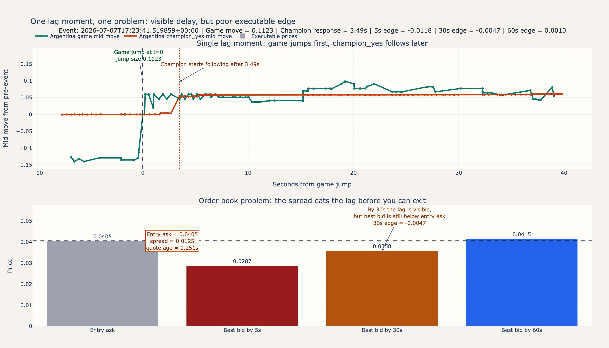

# Visuals

## Single Lag Moment

Linked dataset:
[`argentina_egypt_live`](data/samples/argentina_egypt_live)

This chart is the clearest example of the project's main finding: the lag is
visible, but the executable edge is poor once spread and exit quality are taken
seriously.



Source HTML:
`outputs/single_lag_moment_viz/single_lag_moment_chart.html`

## Matching Time-Series Sample

The visual is linked to the published
[`argentina_egypt_live`](data/samples/argentina_egypt_live) sample. The most
useful files for inspecting the time series behind this chart are:

| File | What it shows |
| --- | --- |
| [`rest_mid_samples.csv`](data/samples/argentina_egypt_live/rest_mid_samples.csv) | Periodic mid-price samples for match and champion markets. |
| [`ws_bbo.jsonl`](data/samples/argentina_egypt_live/ws_bbo.jsonl) | Best bid/offer updates used to inspect executable spread. |
| [`ws_l2book.jsonl`](data/samples/argentina_egypt_live/ws_l2book.jsonl) | Full L2 book snapshots for depth and quote quality. |
| [`ws_trades.jsonl`](data/samples/argentina_egypt_live/ws_trades.jsonl) | Trade prints for checking whether observed moves actually traded. |

Example rows from `rest_mid_samples.csv`:

```csv
ts,coin,label,mid_price
2026-07-07T17:15:07.261235+00:00,#7510,Argentina,0.636155
2026-07-07T17:15:07.261235+00:00,#7511,Egypt,0.363845
2026-07-07T17:15:07.261235+00:00,#1730,argentina_champion_yes,0.11434
2026-07-07T17:15:07.261235+00:00,#1731,argentina_champion_no,0.88566
```

That pairing is the core relationship shown in the chart: the match-market move
appears first, then the champion-market quote follows, but the BBO/L2 sample is
needed to see why the apparent lag did not translate into clean execution.
